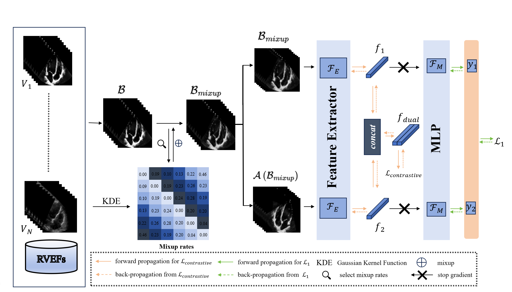

# Dual-Mechanism Deep Imbalanced Regression for Accurate Right Ventricular Ejection Fraction Estimation from 2D Echocardiography
- This is an official implementations for the paper "Dual-Mechanism Deep Imbalanced Regression for Accurate Right Ventricular Ejection Fraction Estimation from 2D Echocardiography"

### Framework

### Requirements
* CUDA>=11.3
  
* Python>=3.8
  
* PyTorch>=1.12.1, torchvision>=0.13.1 (following instructions [here](https://pytorch.org/))

    For example, if your CUDA version is 11.3, you could install pytorch and torchvision as following:
    ```bash
    conda install pytorch=1.12.1 torchvision=0.13.1 cudatoolkit=11.3 -c pytorch
    ```
  
* Other requirements
    ```bash
    pip install -r requirements.txt
    ```


### Dataset preparation

Please download [RVENet dataset](https://rvenet.github.io/dataset/) 

For dataset, if use it for training directly, it wasted a lot. So, we conducted preliminary preprocessing on this dataset, which involved converting DICOM files into AVI video files and applying dynamic filtering to remove noise before saving. This significantly accelerated the training process of the program.

```bash
python process.py 
```

### Training
``` bash
#you can change the trainning details in train.py 
python train.py
```

### Evaluation


```bash
python evaluate.py
```

You can also run distributed evaluation by using ```./tools/run_dist_launch.sh``` or ```./tools/run_dist_slurm.sh```.
